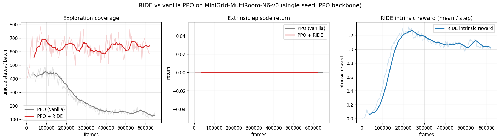

# RIDE: Rewarding Impact-Driven Exploration

Reproduction of [RIDE: Rewarding Impact-Driven Exploration for Procedurally-Generated
Environments](https://arxiv.org/abs/2002.12292) (Raileanu & Rocktäschel, ICLR 2020) on
the [MiniGrid](https://github.com/Farama-Foundation/Minigrid) benchmark.

RIDE is an intrinsic-motivation method for hard-exploration, sparse-reward tasks. It adds
an intrinsic reward

```
r_i(s_t, a_t) = coef * || phi(s_{t+1}) - phi(s_t) ||_2 / sqrt(N_ep(s_{t+1}))
```

that rewards the **impact** of an action — the magnitude of the change it causes in a
learned state embedding `phi` — discounted by the episodic visitation count of the
resulting state. The embedding is trained with the ICM forward + inverse dynamics losses
and is *never* updated by the (intrinsic or extrinsic) reward.

## Components

This example is built from two reusable TorchRL components:

- [`torchrl.objectives.ICMLoss`](../../torchrl/objectives/curiosity.py) — trains the
  embedding `phi`, the forward model and the inverse model.
- [`torchrl.envs.transforms.RIDEReward`](../../torchrl/envs/transforms/ride.py) — reads
  `phi` (detached) and writes the impact-driven intrinsic reward, with the episodic count
  discount.

The two share the **same** embedding network, so the intrinsic reward always reflects the
freshly trained representation. The agent itself is a standard PPO actor-critic
([`ClipPPOLoss`](../../torchrl/objectives/ppo.py)).

## Install

```bash
pip install minigrid gymnasium hydra-core tqdm wandb
```

## Run

RIDE:

```bash
python ride.py
```

Vanilla PPO baseline (no intrinsic reward):

```bash
python ride.py intrinsic.enabled=false logger.exp_name=PPO
```

The default task is the paper's hard-exploration benchmark `MiniGrid-MultiRoom-N6-v0`,
where vanilla PPO stays near zero while RIDE explores room-to-room. Other useful overrides:

```bash
python ride.py env.env_name=MiniGrid-DoorKey-8x8-v0   # easier task both methods solve
python ride.py env.env_name=MiniGrid-MultiRoom-N7-S4-v0 intrinsic.coef=0.5
python ride.py env.serial=true logger.backend=csv optim.device=cuda:0  # robust on Jetson
```

Per the paper, hard-exploration MiniGrid tasks need on the order of 10–20M frames to
converge; expect RIDE to separate from the baseline well before that.

## Results

PPO + RIDE vs vanilla PPO on `MiniGrid-MultiRoom-N6-v0` (single seed, identical PPO
hyperparameters, run on a Jetson Orin via `env.serial=true`):



| metric @ ~0.6M frames | PPO (vanilla) | PPO + RIDE |
|-----------------------|--------------:|-----------:|
| unique states / batch | ~130          | ~630       |
| extrinsic return      | 0.0           | 0.0        |

The headline panel is **exploration coverage** (distinct states visited per batch). RIDE
sustains broad exploration (~600–700 states) while vanilla PPO collapses to a narrow,
repetitive policy (~130 states) — a ≈5× difference, reproducing RIDE's central claim that
impact-driven intrinsic reward keeps the agent exploring. The intrinsic reward rises as the
embedding `φ` becomes discriminative, then tapers as coverage saturates. Neither method
reaches the goal at this scale: MultiRoom-N6 is a very hard exploration task (the paper
reports 10–20M frames to solve the related MultiRoom-N7-S4 with IMPALA), well beyond a short
single-GPU budget — but the coverage signal already isolates RIDE's exploration benefit.

## Key hyperparameters (`config.yaml`)

| Group | Field | Meaning |
|-------|-------|---------|
| `intrinsic` | `enabled` | toggle RIDE (`true`) vs vanilla PPO (`false`) |
| `intrinsic` | `coef` | intrinsic reward coefficient `omega` |
| `intrinsic` | `episodic` | apply the `1/sqrt(N_ep)` episodic count discount |
| `intrinsic` | `forward_loss_weight` / `inverse_loss_weight` | ICM `beta` / `1-beta` |
| `loss` | `entropy_coeff`, `clip_epsilon`, ... | standard PPO hyperparameters |

## Notes

- The benchmark uses MiniGrid's egocentric `7x7x3` symbolic image. Following the paper, the
  raw integer encodings are fed to the CNN as-is (no `/255`); a channel-first float copy is
  used by the networks while the raw integer image is hashed for the episodic count.
- The intrinsic reward is used in raw form (`r = r_e + omega_ir * r_i`), with no running
  normalization, matching the paper. `omega_ir = 0.1` and `entropy_coeff = 0.0001` follow
  the paper's MiniGrid settings.
- The original paper uses an IMPALA backbone; here RIDE — which is backbone-agnostic
  reward augmentation — is plugged into PPO, TorchRL's reference on-policy algorithm.
